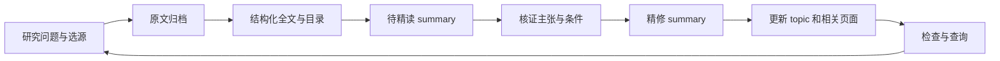

# LLM Wiki 文档处理流程

## TL;DR（快速导读）

这页说明怎样把一篇资料读懂并用进知识库：先保存原文，按问题阅读和核证，再更新摘要与受影响页面。

## 简介

这是本库的日常执行说明。核心方法沿用根级 [LLM Wiki](../../LLM%20Wiki.md)：原始资料保留，知识经阅读与核证编入可持续修订的 wiki；查询也能产生新的稳定页面。根级 [AGENTS.md](../../AGENTS.md) 定义约束，本页解释如何使用工具完成这些约束。

本轮优化把文件接入、内容消化与知识整合拆成可检查的阶段。检索工具负责找到候选，解析工具负责提供可核对的材料，agent 负责阅读、判断与回写。阶段完成需要对应证据，不能用文件数量代替理解程度。



## 具体怎么理解

新增一篇 LoRA 对照实验，应先检查实验条件，再判断它是否修正已有微调结论；保存 PDF 只是开始。

## 关键属性

| 阶段 | 需要产出 | 完成条件 |
|---|---|---|
| 计划 | 研究问题、来源 / 版本、阅读范围、预期影响页 | 明确为什么读，与已有来源是否重复 |
| 归档与抽取 | 原始 HTML / PDF、全文、原始 SHA256、章节 / 页码 | 原文保留，全文无错误页或明显缺失 |
| 初步整理 | `status: auto` summary | 来源链完整，清楚标明仍待精读 |
| 阅读与核证 | 主张、定位、实验配置、局限与冲突 | 原文支持主张；图表和公式按需回看 |
| 精修与整合 | `status: refined` summary、受影响页面、索引、追加日志 | 新旧说法的关系清楚，核心判断可追溯 |
| 验证 | lint、相关工具测试、检索回归与编辑检查 | 结构 errors 为零；尚未解决项列入队列 |

页面状态仍为 `auto / refined` 和 `building / formal`；不增加与之竞争的状态数据库。阶段进度与失败原因记入 `log.md`，可重建检索缓存位于 `.wiki-cache/`。

### 四个 agent 职责

1. **计划**：从索引和工作台确认已有知识，选择问题、来源与处理范围。批量时逐篇执行，先处理会阻塞多个 topic 的关键来源。
2. **阅读**：先看 summary 与原文目录，再读方法、实验、消融、局限和必要附录。区分全文精读与局部精读，保留未覆盖范围。
3. **核证**：重新打开对应原文，逐项检查主张、数值和条件。区分作者报告、已有独立证据与本库综合推断；不要把较高置信度措辞当作证据。
4. **整合**：检查新来源是加强、削弱、修正或冲突于旧说法，更新相关 wiki 页、索引与日志。没有证据的部分保留不确定。

这些职责可以由一个 agent 分阶段完成。当前会话的分工授权决定是否并行；同一篇来源的状态迁移与跨页整合保持一致。

## 相关主张

### 按问题逐步加载上下文

保留文件路径、目录和来源定位，按需读取相关章节，有助于控制上下文范围。这借鉴 [上下文工程 summary](../summaries/Anthropic%20-%202025%20-%20Effective%20Context%20Engineering%20for%20AI%20Agents.md) 的工程思路。工具输出显式标记截断；长任务将已核证结论、决定和下一步记入 wiki 与 log，再继续。

工作台只读生成精读优先级与阅读包：

```bash
.venv/bin/python scripts/wiki_workbench.py audit --limit 12
.venv/bin/python scripts/wiki_workbench.py audit --focus 'LLM RL' --json
.venv/bin/python scripts/wiki_workbench.py plan '来源文件 stem' --question '需要核证的研究问题' --json
.venv/bin/python scripts/wiki_workbench.py plan '来源文件 stem' --section 'Methods' --max-chars 8000
```

优先级来自证据依赖和入链数量，不是学术质量评分。工作台还列出旧精修页中尚未采用定位协议的数量；按需要逐篇核证，不自动改写历史正文或升级待精读来源。

### 抽取应保留可核对结构

HTML 优先，保留标题、链接、MathML / TeX 及普通表格，生成 `source-section-N` 锚点；PDF 后备抽取保留排序文本、`page-N` 锚点和原始页码。新生成的全文记录原始文件 SHA256。原始文件不可覆盖，新版本或新日期快照使用新 stem。

```bash
.venv/bin/python scripts/download_arxiv.py '论文IDv版本' --stem '稳定来源名' --title '论文标题'
.venv/bin/python scripts/fetch_web_text.py '官方URL' 'raw/text/来源名.md' --html-out 'raw/html/来源名.html'
.venv/bin/python scripts/extract_pdf_text.py 'raw/pdf/来源名.pdf'
```

`--force` 只重建派生文本。HTML 的锚点序号与本次抽取绑定，重抽后必须重新核对引用位置。原文 SHA256 用于发现原始快照变动，不能证明派生文字或主张的语义正确。

跨栏、合并单元格、扫描页和重要图表需目视核验。复杂样本再评估 [Docling](../summaries/Docling%20Project%20-%202026%20-%20Document%20Processing%20Overview.md) 等专用解析器。当前提供的文本与结构保留不等于已实现通用 OCR 或高保真版面理解。

### 精修摘要采用主张到原文的定位协议

新精修 summary 带 `evidence_schema: 1` 和 `reviewed: YYYY-MM-DD`。关键事实使用 C1、C2 等编号，并在 `证据定位` 中记录：

| 字段 | 内容 |
|---|---|
| 主张 | 摘要中对应的事实 / 方法 / 数值编号 |
| 原文定位 | 章节锚点或 PDF 的 `#page=N` |
| 配置与条件 | 数据、baseline、硬件、精度、版本、评测口径等相关限制 |
| 证据性质 | 作者报告、独立验证或本库综合推断 |

例如，原始文本链接使用 `../../raw/text/来源名.md#source-section-3` 或 `../../raw/text/来源名.md#page-12`；PDF 链接使用 `../../raw/pdf/来源名.pdf#page=12`。机器检查定位存在、PDF 页码和原始 hash；agent 仍需确认定位里的内容确实支持该主张。

### 查询按范围路由，并保留来源成熟度

实体问题从 concept 进入，比较从 comparison 进入，演进从 timeline 进入，宽主题先拆子问题再读取 topic 与 summary。这是借鉴 [GraphRAG 查询模式](../summaries/Microsoft%20-%202026%20-%20GraphRAG%20Query%20Engine.md) 的任务分层，本库实现仍是 Markdown wiki 与本地搜索。

```bash
.venv/bin/python scripts/search_wiki.py 'SGLang 与 vLLM 架构差异' --json
.venv/bin/python scripts/search_wiki.py '需要查询的问题' --backend local --json
```

默认使用项目独立 qmd BM25 索引并增量刷新。失败时回退本地词面召回；`--backend qmd` 可用于严格诊断。返回文件位置和 `auto / refined / building / formal` 等成熟度，之后打开真实页面核对。备用检索没有语义模型，不保证召回任意同义改写。

片段应携带文档标题、章节、成熟度与位置，避免条件丢失。此处借鉴 [Contextual Retrieval](../summaries/Anthropic%20-%202024%20-%20Introducing%20Contextual%20Retrieval.md) 的上下文保留原则，尚未部署完整的生成式片段注释、embedding 和 reranker。

### 用检查与问题样本验证升级

```bash
.venv/bin/python scripts/lint_wiki.py
.venv/bin/python -m unittest discover -s tests -v
.venv/bin/python scripts/evaluate_retrieval.py --backend local
.venv/bin/python scripts/migrate_wiki_metadata.py
```

检索样本覆盖已有比较、概念、主题、时间线和空结果，检验已知目标页面是否进入候选。它不测量 LLM 答案真实性、完整语义泛化或全库知识覆盖。每次暴露新的实际漏检应增加代表问题；原文支持程度和正式 topic 的综述密度仍需要编辑审查。

引入完整 GraphRAG、额外模型或复杂解析后端之前，先用真实问题 / 困难文档测量增加的收益与开销。[GraphRAG 索引方法](../summaries/Microsoft%20-%202026%20-%20GraphRAG%20Indexing%20Methods.md) 提供成本与噪声取舍的参考，不能直接证明本库必须采用其中某一套系统。

## 来源支持

- [Anthropic 上下文工程](../summaries/Anthropic%20-%202025%20-%20Effective%20Context%20Engineering%20for%20AI%20Agents.md)
- [Anthropic Contextual Retrieval](../summaries/Anthropic%20-%202024%20-%20Introducing%20Contextual%20Retrieval.md)
- [GraphRAG 查询模式](../summaries/Microsoft%20-%202026%20-%20GraphRAG%20Query%20Engine.md)
- [GraphRAG 索引方法](../summaries/Microsoft%20-%202026%20-%20GraphRAG%20Indexing%20Methods.md)
- [Docling 文档处理](../summaries/Docling%20Project%20-%202026%20-%20Document%20Processing%20Overview.md)

## 关联页面

- [LLM Wiki 与检索和文档解析方法](../comparisons/LLM%20Wiki%20与检索和文档解析方法.md)
- [arXiv 与 Hugging Face 论文发现入口](../comparisons/arXiv%20与%20Hugging%20Face%20论文发现入口.md)
- [LLM Wiki](../../LLM%20Wiki.md)、[中文方法文档](../../LLM%20Wiki_zh.md)、[AGENTS.md](../../AGENTS.md)
- 工具：[工作台](../../scripts/wiki_workbench.py)、[检索](../../scripts/search_wiki.py)、[评测](../../scripts/evaluate_retrieval.py)、[结构检查](../../scripts/lint_wiki.py)

## 这里的术语是什么意思

- **baseline**：对照方案：用于判断改动有没有带来收益，条件是否公平尤其重要。
- **embedding**：向量表示：把文字、图片等编码成一组数，用于模型计算或相似度比较。
- **reranker**：重排序模型：对初步召回的候选进一步排序，通常比召回阶段更贵。
- **OCR**：文字识别：从图像读取文字；整页任务还需处理布局和阅读顺序。
- **agent**：代理：围绕任务读材料、调用工具和连续执行的系统；名称本身不保证自主性或质量。
